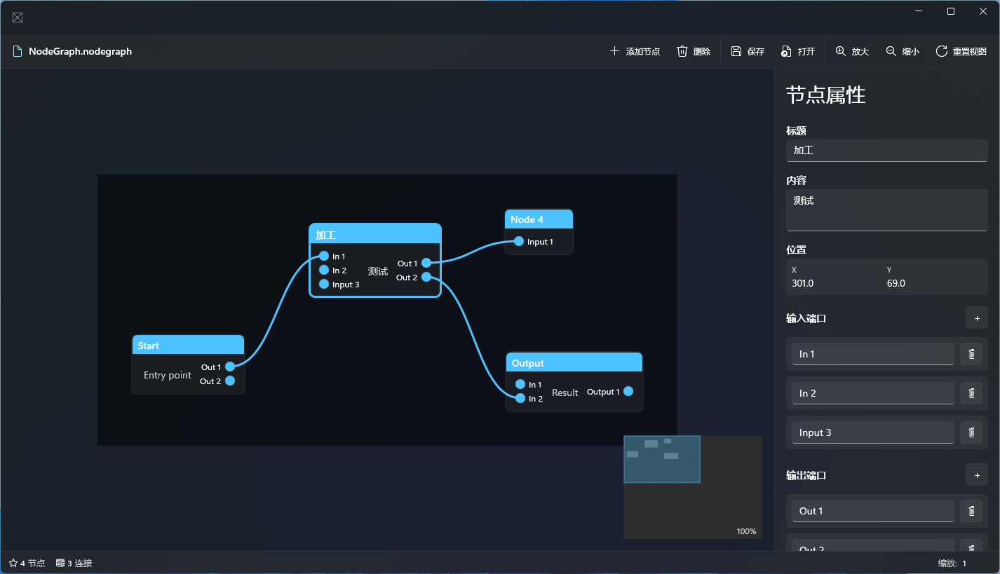

# Nodify.WinUI

A node graph editor built with WinUI 3. Fully (95%) vibe coded.

## Features

- **节点管理** — 双击画布创建节点，拖拽移动，点击选中
- **贝塞尔连接线** — 从端口拖拽连接，双击删除，悬停高亮
- **画布导航** — 中键拖拽平移，Ctrl+滚轮缩放（自动吸附 100%），Shift+滚轮水平平移
- **小地图** — 右下角缩略图，支持拖拽视口矩形导航
- **属性面板** — 选中节点后显示属性，支持动态添加/删除端口
- **序列化** — 保存/加载 `.nodegraph` 文件（JSON 格式，保留视口状态）
- **Mica 背景** — Windows 11 Mica 材质 + 自定义标题栏

## Keyboard Shortcuts

| 快捷键 | 操作 |
|--------|------|
| `Ctrl+N` | 添加节点 |
| `Del` | 删除选中节点 |
| `Ctrl+S` | 保存文件 |
| `Ctrl+O` | 打开文件 |
| `Ctrl++` / `Ctrl+-` | 放大 / 缩小 |
| `Ctrl+0` | 重置视图 |

## Tech Stack

| | |
|---|---|
| UI 框架 | WinUI 3 (Windows App SDK 1.8) |
| 目标框架 | .NET 8 / Windows 10 1903+ |
| MVVM | CommunityToolkit.Mvvm 8.4 |
| 序列化 | System.Text.Json |
| 平台 | x64 |

## Project Structure

```
Nodify.WinUI/
└── Experimental/
    ├── Model/          # 数据模型 (Node, Port, Connection, EditorState)
    ├── ViewModel/      # MVVM 视图模型
    ├── View/           # UI 控件 (Canvas, Node, Connection, Port, MiniMap)
    ├── Converters/     # 值转换器
    └── Helpers/        # 序列化工具
```

## Requirements

- Windows 10 1809 (10.0.17763) 或更高版本
- x64 架构
